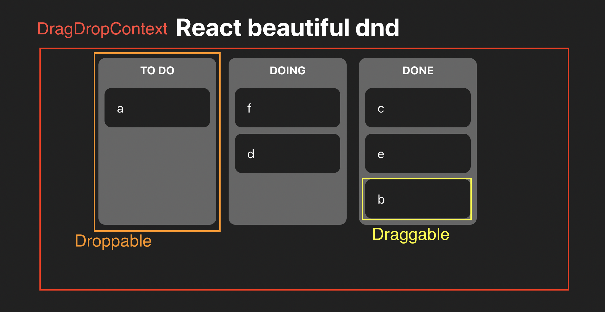

# 리액트 마스터 5

## react-beautiful-dnd

### 구조



- DragDropContext > Droppable > Draggable 의 3개의 태그로 구성이 이루어져 있다.

```html
<!-- 드레그 가능 이동공간을 감싸는 container -->
<DragDropContext>
  <!-- 드레그 가능 아이템들이 이동할 수 있는 공간 ( 공간간에 이동가능 ) -->
  <Droppable>
    <!-- 드레그 가능 아이템 -->
    <Draggable> </Draggable>
  </Droppable>
</DragDropContext>
```

#### DragDropContext

- 드레그 가능 이동공간을 감싸는 container
- onDragEnd 이벤트를 가지고 있어 콜백함수를 실행 가능.
- 콜백함수로 드레그된 상태를 저장한다.

```js
const onDragEnd = ({ draggableId, destination, source }: DropResult) => {
    if (!destination) return;

    setToDos((allBoard) => {
      const srcBoard = source.droppableId;
      const srcIndex = source.index;
      const destBoard = destination.droppableId;
      const destIndex = destination.index;

      if (srcBoard === destBoard) {
        const copyToDos = [...allBoard[srcBoard]];

        copyToDos.splice(srcIndex, 1);
        copyToDos.splice(destIndex, 0, draggableId);

        return {
          ...allBoard,
          [srcBoard]: copyToDos,
        };
      } else {
        const copySrcBoard = [...allBoard[srcBoard]];
        const copyDestBoard = [...allBoard[destBoard]];

        copySrcBoard.splice(srcIndex, 1);
        copyDestBoard.splice(destIndex, 0, draggableId);

        return {
          ...allBoard,
          [srcBoard]: copySrcBoard,
          [destBoard]: copyDestBoard,
        };
      }
    });
  };

<DragDropContext onDragEnd={onDragEnd}>
```

#### Droppable

- 드레그 가능 아이템들이 이동할 수 있는 공간
- droppableId 고유한 아이디를 가져야한다.

```js
<Droppable droppableId={boardId}>
```

- 자식들을 넣을땐 제공하는 함수 return 방식으로 넣는다.

```js
<Droppable droppableId={boardId}>
  {(provided, { isDraggingOver, draggingFromThisWith }) => {
    return (
      <div
        className={`dnd-board ${
          isDraggingOver
            ? 'drag_over'
            : draggingFromThisWith
            ? 'drag_leave'
            : ''
        }`}
      >
        <h2>{boardId.toUpperCase()}</h2>
        <ul {...provided.droppableProps} ref={provided.innerRef}>
          {toDos.map((toDo, index) => (
            <Card toDo={toDo} key={toDo} index={index} />
          ))}
          {provided.placeholder}
        </ul>
      </div>
    );
  }}
</Droppable>
```

- 🧤🧤🧤 {provided.placeholder} 로 아이템들이 들어가는 공간을 고정시킨다.

#### Draggable

- 드레그 가능 아이템
- draggableId 를 속성으로 가진다. 고유한 값
- index 를 속성으로 가진다. 해당 배열에서 아이템을 find 할때 index가 필요하므로 꼭 map 의 index 를 넣어주도록한다.
- 자식들을 넣을땐 제공하는 함수 return 방식으로 넣는다.

```js
<Draggable key={toDo} draggableId={toDo} index={index}>
  {(provided, { isDragging }) => {
    return (
      <li
        className={`dnd-board__item ${isDragging ? 'drag' : ''}`}
        ref={provided.innerRef}
        {...provided.dragHandleProps}
        {...provided.draggableProps}
      >
        {toDo}
      </li>
    );
  }}
</Draggable>
```

### 진행중

1. category 생성
2. trash 생성
3. category 순서변경
